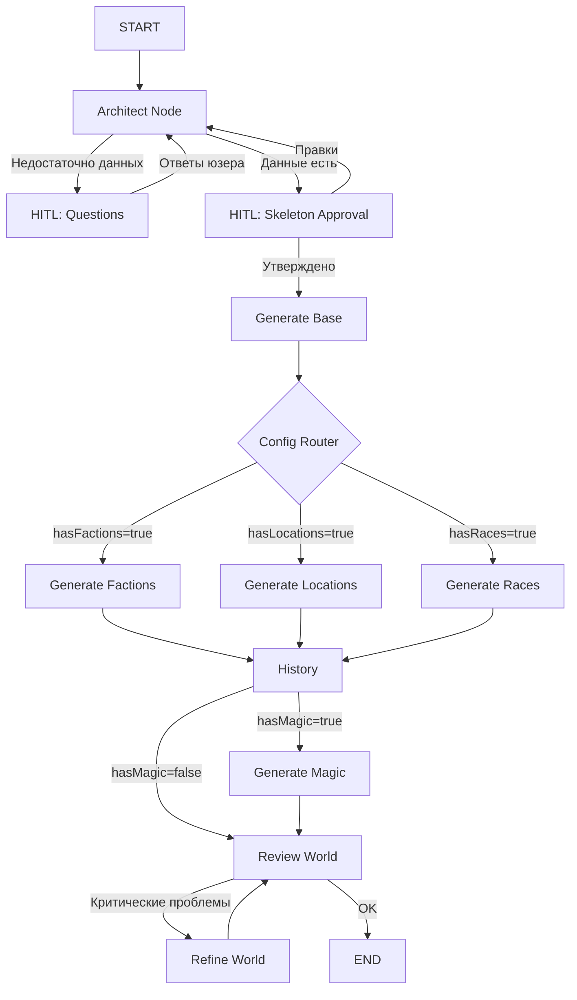

# World Architect: План полной реализации

## Обзор

Это документ-план для завершения внедрения системы **"World Architect"** — улучшенной архитектуры создания миров с агентным проектированием, динамическими вопросами с вариантами ответов и утверждением "Скелета" мира перед генерацией.

---

## ✅ Выполнено

### Backend

1. **Схемы данных** (`src/services/world-creation/agents/schemas.ts`):
   - `GenerationConfigSchema` — определяет, какие модули генерировать
   - `WorldSkeletonSchema` — структура "черновика" мира
   - `ArchitectQuestionSchema` — вопросы с предложенными вариантами ответов
   - `ArchitectResponseSchema` — ответ Архитектора

2. **Architect Agent** (`src/services/world-creation/agents/architect.agent.ts`):
   - Анализирует инпут пользователя и сеттинг
   - Определяет, какие модули нужны (магия, фракции, расы и т.д.)
   - Либо задает уточняющие вопросы с опциями, либо генерирует Скелет

3. **Обновление State** (`src/services/world-creation/graph/state.ts`):
   - Добавлены поля `skeleton` и `config` в граф

4. **Architect Node** (`src/services/world-creation/graph/nodes/architect.node.ts`):
   - Запускает Architect Agent в цикле
   - Обрабатывает вопросы через HITL (Human-in-the-Loop)
   - Обрабатывает утверждение Скелета через HITL
   - Поддерживает цикл "Правка — Утверждение"

5. **Динамические узлы генерации**:
   - Обновлены `factions.node.ts`, `locations.node.ts`, `races.node.ts`, `history.node.ts`, `magic.node.ts`
   - Каждый узел проверяет `state.config` и пропускает генерацию, если модуль выключен

6. **Обновление графа** (`src/services/world-creation/graph/world-generation.graph.ts`):
   - Добавлен `architectNode` как стартовая точка
   - Граф теперь: `START → architect → base → parallel(factions, locations, races) → history → magic → review`

### Frontend

7. **QuestionForm** (`frontend/src/features/world-creation/ui/steps/question-form.tsx`):
   - Переписан для работы с новым форматом `ClarificationRequest`
   - Поддерживает `radio`, `multiselect`, `textarea`, `text`
   - Динамически рендерит поля на основе типа

8. **SkeletonPreview** (`frontend/src/features/world-creation/ui/steps/skeleton-preview.tsx`):
   - Отображает "Паспорт Мира"
   - Позволяет переключать модули (Switch для каждого)
   - Поле для feedback/правок
   - Кнопки "Утвердить и Генерировать" / "Переделать Скелет"

---

## 🔨 Готово к тестированию

### 1. Backend: API Endpoints ✅

**Проверено** — все эндпоинты готовы:
- ✅ `/world-creation/agent/start` — старт сессии
- ✅ `/world-creation/agent/analyze` — анализ инпута
- ✅ `/world-creation/agent/generate/:sessionId/stream` — SSE stream с поддержкой HITL
- ✅ `/world-creation/agent/generate/:sessionId/continue` — продолжение после ответа пользователя
- ✅ Граф запускается с architect node как точкой входа

### 2. Frontend: Логика Wizard ✅

**Выполнено**:
1. ✅ Создана утилита `clarification-utils.ts` с функциями:
   - `isSkeletonApprovalRequest()` — определяет запрос на утверждение скелета
   - `isArchitectQuestions()` — определяет вопросы от архитектора
2. ✅ Обновлен `wizard.tsx`:
   - Добавлен импорт `$clarificationRequest` и `SkeletonPreview`
   - Реализована логика условного рендеринга
3. ✅ Обновлен `init.ts`:
   - Добавлена обработка `continueGenerationFx.doneData`
   - Корректные переходы между шагами при HITL
4. ✅ Создан `sse.ts` для SSE streaming

### 3. Frontend: Wizard Component Integration ✅

**Интегрировано**:
- ✅ `SkeletonPreview` добавлен в wizard
- ✅ `QuestionForm` переписан для работы с новыми типами полей
- ✅ Логика переключения между компонентами реализована:
  ```tsx
  {step === 'questions' && (
    clarificationRequest ? (
      isSkeletonApprovalRequest(clarificationRequest) ? (
        <SkeletonPreview />
      ) : (
        <QuestionForm />
      )
    ) : <Loading />
  )}
  ```

---

## 🧪 Осталось: Тестирование

**Сценарии для тестирования**:

1. **Сценарий 1: High Fantasy**
   - Сеттинг: Fantasy
   - Инпут: "Мрачный мир с магией крови и политическими интригами эльфийских кланов"
   - Ожидание:
     - Архитектор сразу генерирует Скелет
     - Все модули включены (`hasMagic`, `hasFactions`, `hasRaces`)
     - После утверждения генерируются все модули

2. **Сценарий 2: Slice-of-Life**
   - Сеттинг: Contemporary
   - Инпут: "Повседневная жизнь в японской школе, романтика"
   - Ожидание:
     - Архитектор генерирует Скелет с выключенными `hasMagic`, `hasRaces`, `hasFactions`
     - Только `hasLocations` и `hasCharacters` включены
     - Генерация пропускает узлы магии/рас/фракций

3. **Сценарий 3: Недостаточно информации**
   - Сеттинг: Sci-Fi
   - Инпут: "Космос"
   - Ожидание:
     - Архитектор задает вопросы с вариантами:
       - "Какой тип космоса?" → [Hard Sci-Fi, Space Opera, Cyberpunk]
       - "Есть ли пришельцы?" → [Да, много рас / Нет, только люди / Свой вариант]
     - После ответов → генерирует Скелет
     - После утверждения → генерация

4. **Сценарий 4: Правка Скелета**
   - После получения Скелета юзер нажимает "Переделать Скелет"
   - Пишет feedback: "Сделай мир более мрачным, добавь больше политики"
   - Ожидание:
     - Граф вернется в Architect
     - Архитектор перегенерирует Скелет с учетом feedback
     - Снова показывается SkeletonPreview

### 5. API Routes (если нужно)

**Файл**: `src/api/world-creation/agent.routes.ts` (или подобный)

Убедиться, что маршруты корректно обрабатывают:
- `POST /world-creation/agent/start` → `AgentWorldService.startSession()`
- `POST /world-creation/agent/analyze` → `AgentWorldService.analyzeInput()` (если используется)
- `POST /world-creation/agent/continue` → `AgentWorldService.continueGeneration()`
- `GET /world-creation/agent/generate-stream/:sessionId` → SSE stream

---

## Финальный чек-лист перед запуском

- [ ] Backend: Architect Agent корректно мапит жанры на конфиги
- [ ] Backend: График обрабатывает interrupt от Architect
- [ ] Backend: Узлы генерации корректно пропускаются, если модуль выключен
- [ ] Frontend: QuestionForm рендерит radio/multiselect/textarea
- [ ] Frontend: SkeletonPreview показывается при нужном типе ClarificationRequest
- [ ] Frontend: Wizard переключается между QuestionForm и SkeletonPreview
- [ ] Frontend: После утверждения Скелета запускается полная генерация
- [ ] Testing: Проверены все 4 тестовых сценария
- [ ] UX: Все тексты на русском (если outputLanguage=ru)

---

## Преимущества новой архитектуры

1. **Гибкость по жанрам**: Система адаптируется под любой сеттинг, от high fantasy до slice-of-life
2. **Снижение когнитивной нагрузки**: Вместо открытых вопросов — предложенные варианты
3. **Быстрая обратная связь**: Пользователь видит концепцию ДО дорогостоящей генерации
4. **Контроль генерации**: Можно отключить ненужные модули (например, магию в реалистичном мире)
5. **Итеративное улучшение**: Цикл "Скелет → Правки → Скелет" позволяет довести концепт до идеала

---

## Технические детали

### Граф-флоу (новый)



### Ключевые изменения в коде

1. **State расширен**:
   ```typescript
   skeleton: WorldSkeleton | null
   config: GenerationConfig | null
   ```

2. **Узлы проверяют config**:
   ```typescript
   if (state.config && !state.config.hasFactions) {
     return { currentNode: "generateFactions" }; // Skip
   }
   ```

3. **Architect возвращает либо вопросы, либо скелет**:
   ```typescript
   {
     is_ready: boolean,
     questions?: ArchitectQuestion[],
     skeleton?: WorldSkeleton
   }
   ```

---

## Следующие шаги (для нового цикла)

1. **✅ Интегрировать в Wizard**: ВЫПОЛНЕНО - SkeletonPreview и QuestionForm интегрированы
2. **🧪 Провести тестирование**: Запустить все 4 сценария
3. **🔧 Улучшить промпты**: На основе тестов улучшить логику Архитектора
4. **📚 Добавить примеры**: Показывать пользователю примеры миров для вдохновения
5. **🔗 Подключить SSE в GenerationProgress**: Использовать `startGenerationStream` для real-time updates

---

**Статус**: Backend готов на **100%**, Frontend готов на **95%**. Осталось только тестирование и мелкие доработки по результатам тестов.

## Как запустить тестирование

1. **Запустить бэкенд:**
   ```bash
   cd c:\pet_projects\TaleSpinner
   npm run dev
   ```

2. **Запустить фронтенд:**
   ```bash
   cd c:\pet_projects\TaleSpinner\frontend
   npm run dev
   ```

3. **Открыть браузер** и начать создание мира

4. **Проверить консоль** на наличие ошибок

5. **Протестировать все сценарии** из раздела "Тестирование"

## Известные потенциальные проблемы

1. **SSE может не работать корректно** - если генерация зависает на шаге "questions", проверить логи сервера
2. **ArchitectNode может зациклиться** - есть MAX_ITERATIONS=5, но нужно проверить
3. **Модули могут не пропускаться** - если config.hasFactions=false, но фракции всё равно генерируются, проверить логику узлов

---

**ГОТОВО К ТЕСТИРОВАНИЮ!** 🚀
